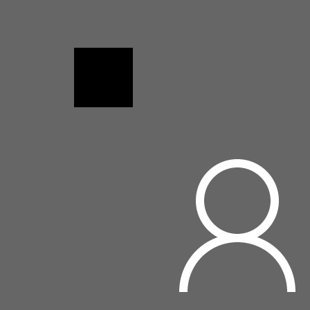
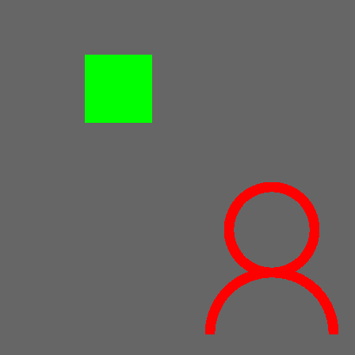
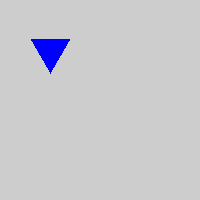
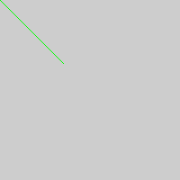
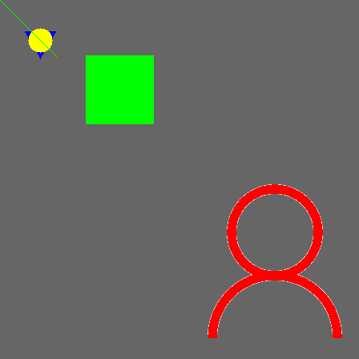

# Ex1：图像读取和显示以及像素操作

> 数据科学与计算机学院 梁文杰 2017级软件工程 16303050

### 1. 读入 1.bmp 文件，并用 CImg.display() 显示。

需要先传入文件（文件放在项目的当前目录下）生成CImg对象：

```c++
CImg<unsigned char> img("./1.bmp");
```

然后调用display方法即可展示图像：

```c++
// 1. 展示图像
static void step1(CImg<unsigned char>& img) {
    img.display();
}
```



### 2. 把图像中白色区域变成红色，黑色区域变成绿色

使用CImg库里的cimg_forXY遍历一遍整个图像，判断每个像素的RGB的值并执行相应的操作即可：

```c++
// 2. 把图像中白色区域变成红色，黑色区域变成绿色
static void step2(CImg<unsigned char>& img) {
    cimg_forXY(img, x, y) {
        if (img(x, y, 0) == 255 && img(x, y, 1) == 255 && img(x, y, 2) == 255) {
            // 填充为红色
            img(x, y, 0) = 255;
            img(x, y, 1) = 0;
            img(x, y, 2) = 0;
        } else if (img(x, y, 0) == 0 && img(x, y, 1) == 0 && img(x, y, 2) == 0) {
            // 填充为绿色
            img(x, y, 0) = 0;
            img(x, y, 1) = 255;
            img(x, y, 2) = 0;
        }
    }
}
```

得到下图结果：


上图可见边界处理得不是很好，调整下参数：

```c++
// 2. 把图像中白色区域变成红色，黑色区域变成绿色
static void step2(CImg<unsigned char>& img) {
    cimg_forXY(img, x, y) {
        // 调整参数使边界保持完整
        // if (img(x, y, 0) == 255 && img(x, y, 1) == 255 && img(x, y, 2) == 255) {
        if (img(x, y, 0) == 120 && img(x, y, 1) == 120 && img(x, y, 2) == 120) {
            // 填充为红色
            img(x, y, 0) = 255;
            img(x, y, 1) = 0;
            img(x, y, 2) = 0;
        } else if (img(x, y, 0) == 0 && img(x, y, 1) == 0 && img(x, y, 2) == 0) {
            // 填充为绿色
            img(x, y, 0) = 0;
            img(x, y, 1) = 255;
            img(x, y, 2) = 0;
        }
    }
}
```

得到下图结果：



### 3. 在图上绘制一个等边三角形区域，其中心坐标(50,50)，边长为 40，填充颜色为蓝色。

可以使用线性规划的方法来确定三角形的区域，底边为x轴，并分别求出两条腰的方程，最后进行坐标变换即可：

```c++
// 定义根号3，等边三角形两条边的方程以及距离公式
#define sqrt3 sqrt(3.0)
#define f1(x) (sqrt3 * x + 20 * sqrt3)
#define f2(x) (-sqrt3 * x + 20 * sqrt3)
#define dis(x, y, x0, y0) (sqrt(pow((x) - (x0), 2) + pow((y) - (y0), 2)))

// 3. 在图上绘制一个等边三角形区域，其中心坐标(50,50)，边长为 40，填充颜色为蓝色。
static void step3(CImg<unsigned char>& img) {
    cimg_forXY(img, x, y) {
        // 进行坐标变换
        double xx = (double)x - 50.0;
        double yy = (double)y - 50.0 + 20.0 * sqrt3 / 3.0;
        // 利用线性规划来划分出等边三角形区域
        if (xx >= -20 && xx <= 20 && yy >= 0 && yy <= f1(xx) && yy <= f2(xx)) {
            // 填充为蓝色
            img(x, y, 0) = 0;
            img(x, y, 1) = 0;
            img(x, y, 2) = 255;
        }
    }
}
```

得到下图结果：



### 4. 在图上绘制一个圆形区域，圆心坐标(50,50)，半径为 15，填充颜色为黄色。

确定圆心和半径，判断点到圆心的距离是否大于半径即可：

```c++
// 4. 在图上绘制一个圆形区域，圆心坐标(50,50)，半径为 15，填充颜色为黄色。
static void step4(CImg<unsigned char>& img) {
    cimg_forXY(img, x, y) {
        if (dis(x, y, 50, 50) <= 15) {
            img(x, y, 0) = 255;
            img(x, y, 1) = 255;
            img(x, y, 2) = 0;
        }
    }
}
```

得到下图结果：


### 5. 在图上绘制一条长为 100 的直线段，起点坐标为(0, 0)，方向角为 135 度，直线的颜色为绿色。

题意理解为从左上角引一条 45 度角长度为 100 的直线段出来，即令 x 等于 y 即可：

```c++
// 5. 在图上绘制一条长为 100 的直线段，起点坐标为(0, 0)，方向角为 135 度，直线的颜色为绿色。
static void step5(CImg<unsigned char>& img) {
    cimg_forXY(img, x, y) {
        if (x == y && dis(x, y, 0, 0) <= 100) {
            img(x, y, 0) = 0;
            img(x, y, 1) = 255;
            img(x, y, 2) = 0;
        }
    }
}
```

得到下图结果：



### 6. 保存操作结果。

确保之前几步操作均在同一个对象中操作，然后调用 img.save() 方法即可：

```c++
// 6. 保存操作结果。
static void step6(CImg<unsigned char>& img) {
    img.save("./2.bmp");
}
```

最后将图像保存在当前目录下的 2.bmp 文件中，图像为：



### 测试代码

```c++
#include <iostream>
#include "CImg.h"
#include "HW1.hpp"
using namespace cimg_library;

class Test {
public:
	Test(CImg<unsigned char>& img) : img(img) {}

	void test1() {
		HW1::step1(img);
		img.save("./step1.bmp");
	}

	void test2() {
		CImg<unsigned char> img(this->img);
		HW1::step2(img);
		img.save("./step2.bmp");
	}

	void test3() {
		CImg<unsigned char> img(200, 200, 1, 3);;
		HW1::step3(img);
		img.save("./step3.bmp");
	}

	void test4() {
		CImg<unsigned char> img(200, 200, 1, 3);;
		HW1::step4(img);
		img.save("./step4.bmp");
	}

	void test5() {
		CImg<unsigned char> img(200, 200, 1, 3);;
		HW1::step5(img);
		img.save("./step5.bmp");
	}

	void test6() {
		HW1::step2(img);
		HW1::step3(img);
		HW1::step4(img);
		HW1::step5(img);
		HW1::step6(img);
		img.save("./step6.bmp");
	}

	void runAll() {
		test1();
		test2();
		test3();
		test4();
		test5();
		test6();
	}

private:
	CImg<unsigned char>& img;
};

int main() {
  CImg<unsigned char> img("./1.bmp");
  Test test(img);
  test.runAll();
}
```

