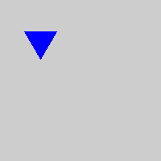
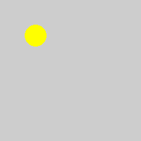
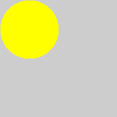

# Ex1：图像读取和显示以及像素操作

> 数据科学与计算机学院 梁文杰 2017级软件工程 16303050

### 1. 读入 1.bmp 文件，并用 CImg.display() 显示。

需要先传入文件（文件放在项目的当前目录下）生成CImg对象：

```c++
CImg<unsigned char> img("./1.bmp");
```

然后调用display方法即可：

```c++
/**
 * @brief 展示一张图像
 *
 * @param title 图像标题
 * @return const MyCImg& 返回当前对象
 */
const MyCImg& display(const char* const title = 0) const {
  img.display(title);
  return *this;
}
```


### 2. 把图像中白色区域变成红色，黑色区域变成绿色

使用CImg库里的cimg_forXY遍历一遍整个图像，判断每个像素的RGB的值并执行相应的操作即可：

```c++
/**
 * @brief 更换图像颜色
 *
 * @param from 需要更换的颜色
 * @param to 更换成的颜色
 * @return MyCImg& 返回当前对象
 */
MyCImg& changeColor(const unsigned char* const from,
                    const unsigned char* const to) {
  cimg_forXY(img, x, y) {
    if (img(x, y, 0) == from[0] && img(x, y, 1) == from[1] &&
        img(x, y, 2) == from[2]) {
      img(x, y, 0) = to[0];
      img(x, y, 1) = to[1];
      img(x, y, 2) = to[2];
    }
  }
  return *this;
}

static const unsigned char white[3] = {255, 255, 255};
static const unsigned char black[3] = {0, 0, 0};
static const unsigned char red[3] = {255, 0, 0};
static const unsigned char green[3] = {0, 255, 0};

void test2() {
  myCImg.changeColor(white, red).changeColor(black, green);
  myCImg.save("./step2.bmp");
}
```

得到下图结果：


上图可见边界处理得不是很好，可以通过调整颜色的参数，得到下图结果：


### 3. 在图上绘制一个等边三角形区域，其中心坐标(50,50)，边长为 40，填充颜色为蓝色。

可以使用线性规划的方法来确定三角形的区域，底边为x轴，并分别求出两条腰的方程，最后进行坐标变换即可：

```c++
/**
 * @brief 画等边三角形
 *
 * @param x0 三角形中心的 x 坐标
 * @param y0 三角形中心的 y 坐标
 * @param length 三角形边长
 * @param color 填充的颜色
 * @return MyCImg& 返回当前对象
 */
MyCImg& drawRegularTriangle(const int x0, const int y0, const int length,
                            const unsigned char* const color) {
  cimg_forXY(img, x, y) {
    // 进行坐标变换
    double xx = (double)x - (double)x0;
    double yy = (double)y - (double)y0 + 20.0 * sqrt3 / 3.0;
    double half = (double)length / 2.0;
    // 利用线性规划来划分出等边三角形区域
    if (xx >= -half && xx <= half && yy >= 0 && yy <= f1(xx) &&
        yy <= f2(xx)) {
      img(x, y, 0) = color[0];
      img(x, y, 1) = color[1];
      img(x, y, 2) = color[2];
    }
  }
  return *this;
}

void test3() {
  // 调用自己实现的方法
  CImg<unsigned char> img(200, 200, 1, 3);
  MyCImg myCImg(img);
  myCImg.drawRegularTriangle(50, 50, 40, blue);
  myCImg.save("./step3-myCImg.bmp");

  // 调用CImg库中的draw_triangle方法
  CImg<unsigned char> img2(200, 200, 1, 3);
  const int x0 = 30;
  const int y0 = 50 - (int)(20 * sqrt(3) / 3.0);
  const int x1 = 70;
  const int y1 = y0;
  const int x2 = 50;
  const int y2 = 50 + (int)(20 * sqrt(3) / 3.0 * 2);
  img2.draw_triangle(x0, y0, x1, y1, x2, y2, blue);
  img2.save("./step3-CImg.bmp");
}
```

两种方法分别得到下图结果：

MyCImg：


CImg：



### 4. 在图上绘制一个圆形区域，圆心坐标(50,50)，半径为 15，填充颜色为黄色。

确定圆心和半径，判断点到圆心的距离是否大于半径即可：

```c++
/**
 * @brief 画圆形
 *
 * @param x0 圆心的 x 坐标
 * @param y0 圆心的 y 坐标
 * @param radius 圆的半径
 * @param color 填充的颜色
 * @return MyCImg& 返回当前对象
 */
MyCImg& drawCircle(const int x0, const int y0, const int radius,
                    const unsigned char* const color) {
  cimg_forXY(img, x, y) {
    double distance = sqrt(pow(x - x0, 2) + pow(y - y0, 2));
    if (distance <= radius) {
      img(x, y, 0) = color[0];
      img(x, y, 1) = color[1];
      img(x, y, 2) = color[2];
    }
  }
  return *this;
}

static const unsigned char yellow[3] = {255, 255, 0};

void test4() {
  // 调用自己实现的方法
  CImg<unsigned char> img(200, 200, 1, 3);
  MyCImg myCImg(img);
  myCImg.drawCircle(50, 50, 15, yellow);
  myCImg.save("./step4-myCImg.bmp");

  // 调用CImg库中的draw_circle方法
  CImg<unsigned char> img2(200, 200, 1, 3);
  img2.draw_circle(50, 50, 15, yellow);
  img2.save("./step4-CImg.bmp");
}
```

两种方法分别得到下图结果：

MyCImg：


CImg：



### 5. 在图上绘制一条长为 100 的直线段，起点坐标为(0, 0)，方向角为 135 度，直线的颜色为绿色。

题意理解为从左上角引一条 45 度角长度为 100 的直线段出来，即令 x 等于 y 即可：

```c++
/**
 * @brief 画线段
 *
 * @param x0 线段起点的 x 坐标
 * @param y0 线段起点的 y 坐标
 * @param tan 线段与 x 轴形成的角度的正切值
 * @param length 线段的长度
 * @param color 线段的颜色
 * @return MyCImg& 返回当前对象
 */
MyCImg& drawLine(const int x0, const int y0, const double tan,
                  const int length, const unsigned char* const color) {
  cimg_forXY(img, x, y) {
    double distance = sqrt(pow(x - x0, 2) + pow(y - y0, 2));
    if (y == x * tan && distance <= length) {
      img(x, y, 0) = color[0];
      img(x, y, 1) = color[1];
      img(x, y, 2) = color[2];
    }
  }
  return *this;
}

void test5() {
  // 调用自己实现的方法
  CImg<unsigned char> img(200, 200, 1, 3);
  MyCImg myCImg(img);
  myCImg.drawLine(0, 0, 1.0, 100, green);
  myCImg.save("./step5-myCImg.bmp");

  // 调用CImg库中的draw_line方法
  CImg<unsigned char> img2(200, 200, 1, 3);
  img2.draw_line(0, 0, 100 * cos(45 * pi / 180), 100 * sin(45 * pi / 180),
                  green);
  img2.save("./step5-CImg.bmp");
}
```

两种方法分别得到下图结果：

MyCImg：


CImg：


### 6. 保存操作结果。

确保之前几步操作均在同一个对象中操作，然后调用 img.save() 方法即可：

```c++
/**
 * @brief 保存图像
 *
 * @param filename 保存的文件名
 * @return const MyCImg& 返回当前对象
 */
const MyCImg& save(const char* const filename) const {
  img.save(filename);
  return *this;
}

void test6() {
  myCImg.drawRegularTriangle(50, 50, 40, blue);
  myCImg.drawCircle(50, 50, 15, yellow);
  myCImg.drawLine(0, 0, 1.0, 100, green);
  myCImg.save("./step6.bmp");
}
```

最后将图像保存在当前目录下的 2.bmp 文件中，图像为：


### 思考：为什么第四步绘制的圆形区域形状效果不好。

圆的尺寸太小，导致得不到较高的分辨率，边界比较不圆润。如增大圆的半径，效果就会更好。如下图半径50的圆：



