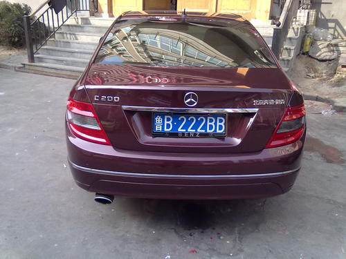
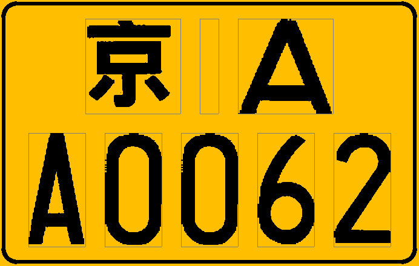

# Ex2：用 CImg 重写 Canny 代码（Code 0）

### 编写头文件

模仿 `canny_source.c` 写出 Canny 边缘检测算法需要用到的方法，并将源代码中各个方法中的参数改写成 C++ 类中的成员变量，最后补上构造和析构函数。

```c++
#pragma
#include <cmath>
#include <cstring>
#include <string>

#include "CImg.h"

using namespace std;
using namespace cimg_library;

class Canny {
 private:
  CImg<unsigned char> img;
  string img_name;     // The name of the image.
  int rows;            // The height of the image.
  int cols;            // The width of the image.
  int* delta_x;        // The first devivative image, x-direction.
  int* delta_y;        // The first derivative image, y-direction.
  float* dir_radians;  // Gradient direction image.
  int* magnitude;      // The magnitude of the gadient image.
  int* smoothedim;     // The image after gaussian smoothing.
  int* nms;            // The image after non-maximize suppression.
  int* edge;           // The image after hysterresis.
  int* lconnect;       // The image after connecting line.
  int* ldelete;        // The image after deleting line.
 public:
  Canny(string img_name);
  ~Canny();

  void canny_edge_detection(float sigma, float tlow, float thig, int distance);
  void save_result(string tag);

  void RGB2Gray();
  void gaussian_smooth(float sigma);
  void make_gaussian_kernel(float sigma, float** kernel, int* windowsize);
  void derrivative_x_y();
  void magnitude_x_y();
  void radian_direction(int xdirtag, int ydirtag);
  double angle_radians(double x, double y);
  void non_max_supp();
  void apply_hysteresis(float tlow, float thigh);
  void follow_edges(int* edgemapptr, int* edgemagptr, int lowval, int cols);

  void connect_line(int distance);
  void delete_line(int distance);

  CImg<unsigned char> matrix2image(int* matrix);
  void image2matrix(CImg<unsigned char> img, int* matrix);
};

```

### 编写源文件

### 主要编写构造和析构函数，以及连接删除边和保存图片相关的代码，其他部分代码与 `canny_source.c` 中的基本相同，由于篇幅过大，那部分代码就不放出来了。

```c++
#include "canny.h"

#define M_PI 3.14159265358979323846
#define BOOSTBLURFACTOR 90.0
#define NOEDGE 255
#define POSSIBLE_EDGE 128
#define EDGE 0
#define IMGPATH "./img/"

using namespace std;
using namespace cimg_library;

static int black[] = {0, 0, 0};

Canny::Canny(string img_name) : img_name(img_name) {
  img = CImg<unsigned char>(string(IMGPATH + img_name).c_str());
  rows = img.height();
  cols = img.width();

  delta_x = new int[rows * cols];
  delta_y = new int[rows * cols];
  dir_radians = new float[rows * cols];
  magnitude = new int[rows * cols];
  smoothedim = new int[rows * cols];
  nms = new int[rows * cols];
  edge = new int[rows * cols];
  lconnect = new int[rows * cols];
  ldelete = new int[rows * cols];

  memset(delta_x, 0, rows * cols * sizeof(int));
  memset(delta_y, 0, rows * cols * sizeof(int));
  memset(dir_radians, 0, rows * cols * sizeof(float));
  memset(magnitude, 0, rows * cols * sizeof(int));
  memset(smoothedim, 0, rows * cols * sizeof(int));
  memset(nms, 0, rows * cols * sizeof(int));
  memset(edge, 0, rows * cols * sizeof(int));
  memset(lconnect, 0, rows * cols * sizeof(int));
  memset(ldelete, 0, rows * cols * sizeof(int));
}

Canny::~Canny() {
  delete[] delta_x;
  delete[] delta_y;
  delete[] dir_radians;
  delete[] magnitude;
  delete[] nms;
  delete[] edge;
  delete[] lconnect;
  delete[] ldelete;
}

void Canny::canny_edge_detection(float sigma, float tlow, float thig,
                                 int distance) {
  RGB2Gray();
  gaussian_smooth(sigma);
  derrivative_x_y();
  magnitude_x_y();
  radian_direction(-1, -1);
  non_max_supp();
  apply_hysteresis(tlow, thig);

  connect_line(distance);
  delete_line(distance);
}

void Canny::connect_line(int distance) {
  CImg<unsigned char> img = matrix2image(edge);

  bool isEdge[1000][1000];
  int dx[8] = {1, 1, 0, -1, -1, -1, 0, 1}, dy[8] = {0, 1, 1, 1, 0, -1, -1, -1};

  cimg_forXY(img, x, y) {
    isEdge[x][y] = false;
    if (x != rows - 1 && x != 0 && y != cols - 1 && y != 0 && img(x, y) == 0) {
      int neighbors[8], m = 0;
      for (int i = 0; i < 8; i++) {
        int di = x + dx[i], dj = y + dy[i];
        if (di != x || dj != y) neighbors[m] = img(di, dj), m++;
      }
      sort(neighbors, neighbors + 8);
      isEdge[x][y] = (neighbors[0] == 0 && neighbors[1] == 255);
    }
  }

  cimg_forXY(img, x, y) {
    if (x >= distance && x <= rows - 1 - distance && y >= distance &&
        y <= cols - 1 - distance && isEdge[x][y] == true) {
      for (int i = x - distance; i <= x + distance; i++) {
        for (int j = y - distance; j <= y + distance; j++) {
          if (isEdge[i][j] == true) {
            img.draw_line(x, y, i, j, black);
            isEdge[i][j] = false, isEdge[x][y] = false;
          }
        }
      }
    }
  }

  image2matrix(img, lconnect);
}

void Canny::delete_line(int distance) {
  CImg<unsigned char> img = matrix2image(lconnect);

  bool isEdge[1000][1000];
  int dx[8] = {1, 1, 0, -1, -1, -1, 0, 1}, dy[8] = {0, 1, 1, 1, 0, -1, -1, -1};

  cimg_forXY(img, x, y) {
    isEdge[x][y] = false;
    if (x != rows - 1 && x != 0 && y != cols - 1 && y != 0 && img(x, y) == 0) {
      int neighbors[8], m = 0;
      for (int i = 0; i < 8; i++) {
        int di = x + dx[i], dj = y + dy[i];
        if (!(di == x && dj == y)) {
          neighbors[m] = img(di, dj), m++;
        }
      }
      sort(neighbors, neighbors + 8);
      if (neighbors[0] == 0 && neighbors[1] == 255) isEdge[x][y] = true;
      if (neighbors[0] == 255) img(x, y) = 255;
    }
  }

  cimg_forXY(img, x, y) {
    if (isEdge[x][y] == true) {
      int beg_x = x - distance > 0 ? x - distance : 0;
      int beg_y = y - distance > 0 ? y - distance : 0;
      int end_x = x + distance < rows - 1 ? x + distance : rows - 1;
      int end_y = y + distance < cols - 1 ? y + distance : cols - 1;
      for (int i = beg_x; i <= end_x; i++) {
        for (int j = beg_y; j <= end_y; j++) {
          if (isEdge[i][j]) {
            int max_x = x >= i ? x : i;
            int max_y = y >= j ? y : j;
            int min_x = max_x == x ? i : x;
            int min_y = max_y == y ? j : y;
            for (int ii = min_x; ii <= max_x; ii++) {
              for (int jj = min_y; jj <= max_y; jj++) {
                img(ii, jj) = 255;
              }
            }
            isEdge[i][j] = false, isEdge[x][y] = false;
          }
        }
      }
    }
  }

  cimg_forXY(img, x, y) {
    isEdge[x][y] = false;
    if (x != rows - 1 && x != 0 && y != cols - 1 && y != 0 && img(x, y) == 0) {
      int neighbors[8], m = 0;
      for (int i = 0; i < 8; i++) {
        int di = x + dx[i], dj = y + dy[i];
        if (!(di == x && dj == y)) neighbors[m] = img(di, dj), m++;
      }
      sort(neighbors, neighbors + 8);
      if (neighbors[0] == 255) img(x, y) = 255;
    }
  }

  image2matrix(img, ldelete);
}

#include <iostream>

void Canny::save_result(string tag) {
  std::cout << string("./result/" + tag + "" + this->img_name).c_str() << std::endl;
  img.save(string("./result/" + tag + "00-" + this->img_name).c_str());
  matrix2image(smoothedim).save(string("./result/" + tag + "01-guassian-"+ this->img_name).c_str());
  matrix2image(nms).save(string("./result/" + tag + "02-nms-"+ this->img_name).c_str());
  matrix2image(edge).save(string("./result/" + tag + "03-edge-" + this->img_name).c_str());
  matrix2image(lconnect).save(string("./result/" + tag + "04-connect-"+ this->img_name).c_str());
  matrix2image(ldelete).save(string("./result/" + tag + "05-delete-"+ this->img_name).c_str());
}

CImg<unsigned char> Canny::matrix2image(int* matrix) {
  CImg<unsigned char> img(rows, cols, 1, 1, 5);
  img.fill(0);
  cimg_forXY(img, x, y) { img(x, y, 0) = matrix[x * cols + y]; }
  return img;
}

void Canny::image2matrix(CImg<unsigned char> img, int* matrix) {
  cimg_forXY(img, x, y) { matrix[x * cols + y] = img(x, y, 0); }
}
```

### 编写测试代码

编写一个 `main.cpp` 用于测试。

```c++
#include <list>
#include <sstream>
#include <string>
#include "canny.h"
using std::list;
using std::stringstream;

class Test {
 public:
  Test(Canny& img) : img(img) {}
  void test(float sigma, float tlow, float thig, int distance) {
    img.canny_edge_detection(sigma, tlow, thig, distance);
  }
  void save(string tag) { img.save_result(tag); }

 private:
  Canny& img;
};

int main() {
  list<string> images({"3.bmp", "4.bmp", "20160326110137505.bmp", "bigben.bmp",
                       "lena.bmp", "stpietro.bmp"});
  for (auto it = images.begin(); it != images.end(); ++it) {
    Canny img(*it);
    Test test(img);
    test.test(1.5, 0.3, 0.75, 10);
    test.save("");
  }
  return 0;
}
```

上述代码中四个参数

- `float sigma`：1.5
- `float tlow`：0.3
- `float thig`：0.75
- `int distance`：10

的值是经过多次调参得出的，调参过程的结果可以在 `code/result/` 目录中查看。

### 删除短边的优缺点

删除短边可以去掉一些离散的边缘，减少噪声，但可能会误删真实存在的短边。

### 各参数对结果的影响

- `sigma` ：Standard deviation of the gaussian kernel.

  > 标准差减小时，会增加噪声；标准差增大时，原来的强边缘像素大部分被误认为噪声，会造成边缘缺失。

- `tlow` ：Fraction of the high threshold in hysteresis.

  > 低阈值减小时，会增加噪声；低阈值增大时，会丢失强边缘像素。

- `thig` ：High hysteresis threshold control. The actual is the (100 * thigh) percentage point the histogram of the magnitude of the image that passes non-maximal.

  > 高阈值减小时，会增加强边缘像素；高阈值增大时，强边缘像素部分会转化为弱边缘像素，丢失部分边缘像素点。

### 程序运行结果








### 总结

图像经过灰度处理，高斯滤波去噪，应用非极大值压制以及双阈值检测得到的边缘检测结果还算是比较理想，最后加上自己编写的合并相邻的线条和删除短线条，即使通过调参，都没有太明显的效果。