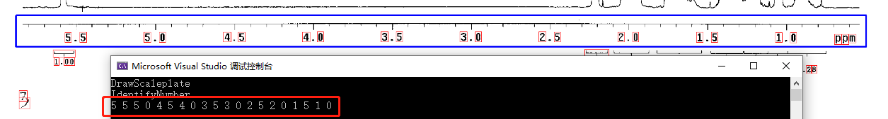

# Ex4

> 数据科学与计算机学院 2019级 软件工程 16303050 梁文杰

## Part1 把图像前后景分割

图像分割的方法有很多种，由于本次作业中不需要使用所给图像进行测试，我实现了一种相对比较简单的极小值阈值法分割，原理为：统计图像中各像素值出现的频率，寻找频率的极小值，将其作为图像分割的阈值，小于该阈值的像素赋值为0，大于的则赋值为255，实现图像前后景的分割。

下次作业考虑补充实现 OSTU 最佳全局阈值处理（最大类间方差法）分割。

## Part2 把图像中的数字切割出来

基本思路为：

1. 先做图像的 Erosion（腐蚀操作）
2. 求出图像中的连通块
3. 去除黑色像素大于 Th（Th=500）或小于 Tl（Tl=80）的连通块
4. 在原图上把连通块（Tl <= 黑色像素 <= Th）用红色框标记

### 步骤一 做图像的腐蚀操作

我将腐蚀操作定义为将白色像素变为黑色像素，而将膨胀操作定义为将黑色像素变为白色像素。

具体实现为将图中的黑色像素扩展到其相邻像素，即将1\*1的黑色像素扩展为3\*3的黑色像素。

将图像遍历一遍即可。

### 步骤二 求出图像中的连通块

使用深搜（DFS）的方法求解图像中的连通块，用一个链表存储连通块中每一个像素的位置，用另一个同等大小的图像记录像素是否被搜索过。从图像的第一个像素开始，向八个方向寻找连通块。时间复杂度为 O(n)，因此程序运行速度非常快。

### 步骤三 去除黑色像素大于 Th（Th=500）或小于Tl（Tl=80）的连通块

根据步骤二找到的连通块中所含黑色像素的个数进行相应的保留或删除操作，如果其黑色像素大于 Th（Th=500）或小于 Tl（Tl=80），则将该连通块中所以像素值置为 0。

### 步骤四 在原图上把连通块（Tl <= 黑色像素 <= Th）用红色框标记

如果步骤二找到的连通块中其黑色像素小于等于 Th（Th=500）且大于等于 Tl（Tl=80），则先找出该连通块的像素边界，用 lx，rx，ly，ry 记录，再加上合适的框内边距，使用 draw_line 函数将连通块框起来。

## Part3 把图像中标尺 OCR

基本思路为：

1. 计算标尺对应的位置和区域
2. 识别标尺图像中的刻度数字

#### 步骤一 计算标尺对应的位置和区域

寻找图中最长的横向，只需遍历一遍图像，即可定位刻度尺的位置。

#### 步骤二 识别标尺图像中的刻度数字

在 Part2 寻找的连通块中提取出需要的数字作为训练集，保存在本地，程序运行时再导入训练集，识别刻度数字时进行比对，如匹配则记录下匹配数字。最终识别结果：

