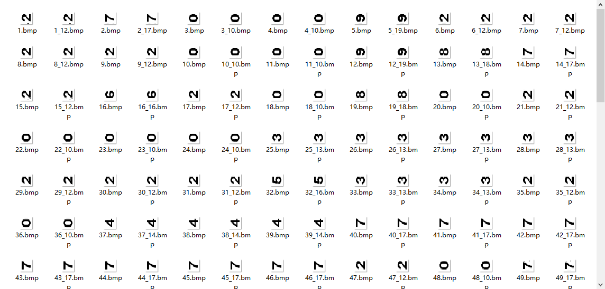
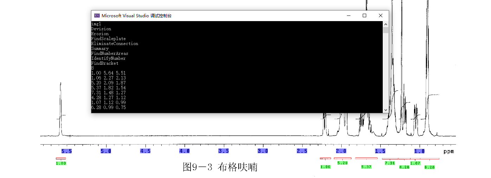
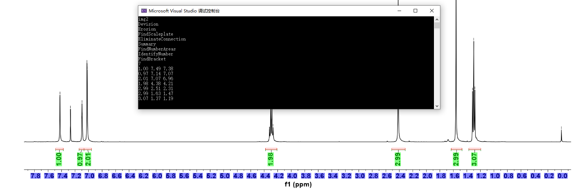

# Ex5

> 数据科学与计算机学院 2019级 软件工程 16303050 梁文杰

## 任务一 切割并识别数字

与上次实验类似，先对图像进行前后景分割（二值化处理），随后进行腐蚀操作，删除过大或过小的连通块。

### 前后景分割

本次实验前后景分割算法使用的是自适应阈值法进行分割，即先统计图像中像素值的分布情况，寻找双峰，并在双峰之间找到极小值，取极小值作为该图像前后景分割的阈值。实现也比较简单。

### 进一步筛选连通块

然后对得到的连通块做进一步的处理，统计连通块中面积大小的分布情况，**得出图像中数字的大致尺寸**，进而进一步筛掉非数字的连通块。

### 划分数字区域

根据得到的数字连通块集合，对连通块的**纵坐标**进行处理，划分出三个不同的区域，分别为：上半区，下半区和刻度尺区。区域的边界由区域内连通块的边界的最大最小值决定。

### 切割数字

在数字区域内将相邻的几个连通块组合起来，组成一个相对较大一点的区域，作为需要识别的数字区域。根据第一个找到的数字区域确定数字区域的尺寸，并将该尺寸用于切割其他区域，这能够将之前漏掉的数字重新包括进来。

### 数字识别

本次实验使用KNN的算法进行数字识别。从网上找了一些印刷体的数字图片，从0到9每个数字均有1016张训练图片作为训练集，将所有图片横向放置构成另外的数据集。KNN算法的原理也很简单，对测试集的预测就是求测试图片与训练集中的第K个最相近的图片中包含最多的标签。

然后将实验图像中分割出来的数字图像作为测试集查看模型的准确率如何。识别效果如下，能达到99%以上的正确率：（1_12.bmp表示第一张图，识别结果为横向的数字2）

## 任务二 分割并识别括号

### 确定刻度值

先识别出刻度尺的位置，然后根据刻度尺下的数字计算出刻度尺每个位置对应的数值。

### 分割水平括号

分割出水平括号，找到括号的两个端点和中点，并根据中点找到对应的数字。识别相应的数字，以及计算出两端的刻度值。

