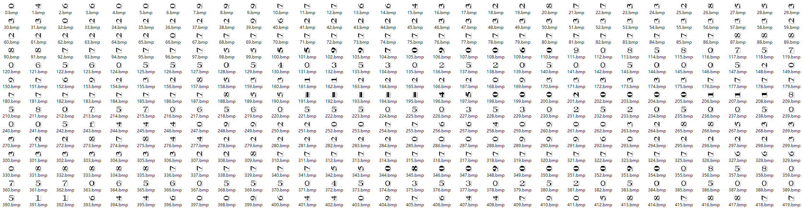
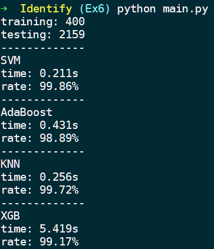
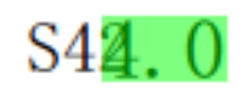
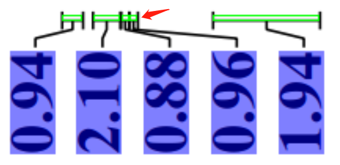
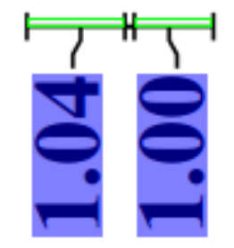

# Ex6

> 数据科学与计算机学院 2019级 软件工程 教务二班 梁文杰 16303050

## 任务二

从给出的数据中任选 16 张图片，8 张作为训练集，8 张作为测试集。对其做切割、聚类和人工标注，获得印刷体的数据集。

### 切割（数据集获取）

> 步骤子目录为 Division

#### 二值化

把一个灰度图像二值化，其实就是找到一个阈值，图像中像素值大于这个阈值的，设置成 255，像素值小于这个阈值的，设置为 0。 

将二值化的操作封装成一个函数，传入一个二值化的阈值参数 `tbin`，如果该值为 0 ，则进行阈值自适应二值化，即通过图像像素值的直方图自动寻找合适的阈值进行二值化。

```c++
// 二值化处理
void Division::Binaryzation(CIMG& img, int tbin) {
  cout << "Binaryzation" << endl;
  if (tbin == 0) {
    int cnt[256], m1 = 0, m2 = 0, min, i, j;
    // 统计像素直方图
    for (i = 0; i < 256; i++) cnt[i] = 0;
    cimg_forXY(img, x, y) { cnt[img(x, y)]++; }
    // 直方图平滑
    for (i = 0; i < 1000; i++)
      for (j = 1; j < 255; j++) {
        cnt[j] = (cnt[j - 1] + cnt[j] + cnt[j + 1]) / 3;
      }
    // 寻找双峰
    for (i = 1; i < 256; i++) {
      if (cnt[i] > cnt[m1]) {
        m2 = m1, m1 = i;
      } else if (cnt[i] > cnt[m2]) {
        m2 = i;
      }
    }
    // 寻找谷底
    if (m1 > m2) std::swap(m1, m2);
    min = m1;
    for (i = m1 + 1; i < m2; i++) {
      if (cnt[i] < cnt[min]) {
        min = i;
      }
    }
    tbin = min;
  }
  // 二值化
  cimg_forXY(img, x, y) { img(x, y) = img(x, y) < tbin ? 0 : 255; }
}
```

#### 腐蚀/膨胀

- 膨胀： 此操作将图像 A 与任意形状的内核 B，通常为正方形或圆形，进行卷积。  内核 B 有一个可定义的锚点，通常定义为内核中心点。进行膨胀操作时，将内核 B 划过图像,将内核 B 覆盖区域的最大相素值提取，并代替锚点位置的相素。
- 腐蚀： 腐蚀在形态学操作家族里是膨胀操作的孪生姐妹。它提取的是内核覆盖下的相素最小值。进行腐蚀操作时，将内核 B 划过图像,将内核 B 覆盖区域的最小相素值提取，并代替锚点位置的相素。

本次实验实际没有对图像进行腐蚀或膨胀操作，相关代码如下：

```c++
// 腐蚀
void Division::Eroding(CIMG in, CIMG& out, int n) {
  cout << "Eroding" << endl;
  cimg_forXY(out, i, j) {
    bool flag = false;
    for (int x = -n / 2; x <= n / 2; x++) {
      if (flag) break;
      for (int y = -n / 2; y <= n / 2; y++) {
        int xx = i + x, yy = j + y;
        if (InImage(xx, yy) && !in(xx, yy)) {
          flag = true;
          break;
        }
      }
    }
    out(i, j) = flag ? 0 : 255;
  }
}

// 膨胀
void Division::Dilating(CIMG in, CIMG& out, int n) {
  cout << "Dilating" << endl;
  cimg_forXY(out, i, j) {
    bool flag = false;
    for (int x = -n / 2; x <= n / 2; x++) {
      if (flag) break;
      for (int y = -n / 2; y <= n / 2; y++) {
        int xx = i + x, yy = j + y;
        if (InImage(xx, yy) && in(xx, yy)) {
          flag = true;
          break;
        }
      }
    }
    out(i, j) = flag ? 255 : 0;
  }
}
```

#### 消除连通块

为了避免栈溢出的问题，使用**广度优先搜索**的方法来获取连通块，并将连通块中像素个数大于阈值 `tcon` 或小于阈值 `tnum` 则将该连通块中所有元素的像素值置为 255。否则将该连通块的位置信息保存。

```c++
// 消除过大或过小连通块并记录有效连通块
void Division::EliminateConnection(CIMG& img, int tcon, int tnum) {
  cout << "EliminateConnection" << endl;
  int* con = new int[width * height * 2];  // 记录连通块像素位置
  bool* vis = new bool[width * height];    // 记录已遍历的像素位置
  memset(vis, 0, sizeof(bool) * width * height);

  int cnt_con, lx, rx, ly, ry, tail, xx, yy;
  // 遍历图像
  cimg_forXY(img, x, y) {
    // 未遍历且像素值为 0
    if (!img(x, y) && !vis(x, y)) {
      cnt_con = 0;  // 记录当前连通块像素个数
      vis(x, y) = 1;
      con(cnt_con, 0) = x;
      con(cnt_con, 1) = y;
      lx = rx = x;
      ly = ry = y;
      tail = 0;
      // bfs查找
      while (tail <= cnt_con) {
        for (int i = 0; i < 8; i++) {
          xx = dir[i][0] + con(tail, 0);
          yy = dir[i][1] + con(tail, 1);
          if (xx < lx) lx = xx;
          if (yy < ly) ly = yy;
          if (xx > rx) rx = xx;
          if (yy > ry) ry = yy;
          if (InImage(xx, yy) && !vis(xx, yy) && !img(xx, yy)) {
            ++cnt_con;
            vis(xx, yy) = 1;
            con(cnt_con, 0) = xx;
            con(cnt_con, 1) = yy;
          }
        }
        tail++;
      }
      // 大于某阈值或小于某阈值则删除
      if (cnt_con > tcon || cnt_con < tnum) {
        for (int i = 0; i < cnt_con; i++) {
          img(con(i, 0), con(i, 1)) = 255;
        }
      } else {
        // MarkRectangle(result, lx, ly, rx, ry, red);
        StoreConnection(lx, ly, rx, ry);
      }
    }
  }

  delete[] vis;
  delete[] con;
}

// 保存连通块
void Division::StoreConnection(int lx, int ly, int rx, int ry) {
  recs.push_back(Rectangle({lx, ly, rx, ry}));
}
```

#### 进一步筛选数字

上一步消除连通块的操作也许还保留了许多并非是数字的连通块，并根据图像中数字的位置相对统一的特征，可以对连通块的位置信息（左边界、右边界、上边界、下边界、面积）进行**统计**，保留与**大多数**连通块具有相同位置信息的连通块，由此进一步筛选出需要的数字。

```c++
typedef std::pair<int, int> record_t;
struct RecordComparer {
  bool operator()(const record_t& a, const record_t& b) {
    return a.second > b.second;
  }
};

// 使用最小堆解决 Top K 问题
void Division::Statistics(unordered_map<int, int> um, set<int>& result,
                          int tsum) {
  priority_queue<record_t, vector<record_t>, RecordComparer> heap;
  auto it = um.begin();
  for (int i = 0; i < tsum && it != um.end(); i++, it++) heap.push(*it);
  for (; it != um.end(); it++) {
    if (it->second > heap.top().second) {
      heap.pop(), heap.push(*it);
    }
  }
  while (!heap.empty()) {
    result.insert(heap.top().first);
    heap.pop();
  }
}

// 统计位置信息
void Division::Statistics(int tsum) {
  cout << "Statistics" << endl;
  set<int> lxs, lys, rxs, rys, areas;
  unordered_map<int, int> lxm, lym, rxm, rym, aream;
  for (auto e : recs)
    lxm[e.lx]++, lym[e.ly]++, rxm[e.rx]++, rym[e.ry]++, aream[e.area]++;
  Statistics(lxm, lxs, tsum);
  Statistics(lym, lys, tsum);
  Statistics(rxm, rxs, tsum);
  Statistics(rym, rys, tsum);
  Statistics(aream, areas, tsum);
  bool lx, ly, rx, ry, area;
  for (auto it = recs.begin(); it != recs.end();) {
    lx = (lxs.find(it->lx) != lxs.end());
    ly = (lys.find(it->ly) != lys.end());
    rx = (rxs.find(it->rx) != rxs.end());
    ry = (rys.find(it->ry) != rys.end());
    area = (areas.find(it->area) != areas.end());
    // 面积不满足符合大多数特征，或四个边界特征没有一个满足则移除
    if (!area || lx + ly + rx + ry < 1) {
      it = recs.erase(it);
    } else {
      it++;
    }
  }
  printf("amount of number: %d\n", recs.size());
  for (auto e : recs) {
    // 在图上标记数字边界
    MarkRectangle(result, e.lx, e.ly, e.rx, e.ry, red);
  }
}

// 标记矩形区域
void Division::MarkRectangle(CIMG& img, int lx, int ly, int rx, int ry,
                             uchar_t* color) {
  img.draw_line(lx, ly, rx, ly, color);
  img.draw_line(lx, ly, lx, ry, color);
  img.draw_line(rx, ly, rx, ry, color);
  img.draw_line(lx, ry, rx, ry, color);
}
```

#### 将数字保存成图片

为了后期方便处理，保存时将图像尺寸统一为 16*16。

```c++
// 保存数字
void Division::SaveNumber(const string& path) {
  cout << "SaveNumber" << endl;
  for (auto rec : recs) {
    CIMG num(rec.rx - rec.lx + 1, rec.ry - rec.ly + 1, 1, 1);
    cimg_forXY(num, x, y) { num(x, y) = src(x + rec.lx, y + rec.ly); }
    num.resize(num_width, num_height);
    num.save((path + std::to_string(Division::num_cnt) + ".bmp").c_str());
    Division::num_cnt++;
  }
}
```

#### 获得的结果如下



### 聚类（数据集标注）

> 步骤子目录为 Cluster

将上述导出的数字图像聚类得到 20 大类，分别是正向的 0-9 以及横向的 0-9，得到的聚类结果加上适当的手动调整，将数据集进行有效划分训练集和测试集。为使得训练集中各个数字的数量相同，将数量较少的数字复制成多份，或将横向的旋转成正向来使用，最终以每个数字10张图片作为训练集的数据，并对其进行标注。剩下的可加入到测试集中。

```python
from sklearn.cluster import KMeans
from PIL import Image
import numpy as np
import os


def load_img(path, n):
    features = []
    images = []
    for i in range(n):
        img = Image.open('{}/{}.bmp'.format(path, i))
        images.append(img)
        img = np.array(img)
        img = img[:, :, 0]
        features.append(img.reshape([-1]) / (255))
    return images, features


def task(step):
    images, features = load_img('../{}/num'.format(step))
    kmeans = KMeans(n_clusters=20, random_state=0).fit(features)
    labels = kmeans.labels_

    cluster = {}
    for i in range(len(labels)):
        if labels[i] not in cluster:
            cluster[labels[i]] = [images[i]]
        else:
            cluster[labels[i]].append(images[i])
    for key, image_list in cluster.items():
        cnt = 0
        for image in image_list:
            path = './{}/i{}'.format(step, key)
            if not os.path.exists(path):
                os.makedirs(path)
            image.save('{}/{}_{}.bmp'.format(path, key, cnt))
            cnt += 1


if __name__ == "__main__":
    task('train', 1088)
    task('test', 2200)
```

### 识别（数据集测试）

> 步骤子目录为 Identify

#### 数据导入

```python
def load_data(path):
    data, label = [], []
    for i in range(20):
        for root, dirs, files in os.walk(path + str(i)):
            cnt = 0
            for file in files:
                label.append(i)
                img = Image.open('{}{}/{}.bmp'.format(path, i, str(cnt)))
                img = np.array(img)
                img = img[:, :, 0]
                data.append(img.reshape([-1]) / (255))
                cnt += 1
    return data, label


if __name__ == "__main__":
    train, train_label = load_data("../Cluster/train/")
    test, test_label = load_data("../Cluster/test/")
```

#### 识别模块

```python
def identify(algorithm, model, train, train_label, test, test_label):
    start = time.time()
    model.fit(train, train_label)    # 训练
    pre_label = model.predict(test)  # 识别
    end = time.time()
    rate = sum(pre_label == test_label) / len(test_label)*100
    print('-------------')
    print(algorithm)
    print('time: {}s'.format(round(end-start, 3)))
    print('rate: {}%'.format(round(rate, 2)))
```

#### SVM

**关键参数**

- `C`：错误项的惩罚系数,默认值为 1.0。C越大，即对分错样本的惩罚程度越大，因此在训练样本中准确率越高，但是泛化能力降低，也就是对测试数据的分类准确率降低。相反，减小C的话，容许训练样本中有一些误分类错误样本，泛化能力强。对于训练样本带有噪声的情况，一般采用后者，把训练样本集中错误分类的样本作为噪声。

- `kernel：str`参数 ’算法中采用的核函数类型，默认为 `rbf`，可选参数有：
  - `linear`：线性核函数
  - `poly`：多项式核函数
  - `rbf`：径像核函数/高斯核
  - `sigmod`：sigmod 核函数
  - `precomputed`：核矩阵 precomputed 表示自己提前计算好核函数矩阵，这时候算法内部就不再用核函数去计算核矩阵，而是直接用你给的核矩阵。

- `gamma`：核函数系数，默认为 auto。如果 gamma 为 auto，代表其值为样本特征数的倒数，即 1/n_features。

- `probability`： 是否启用概率估计，默认为False。这必须在调用 fit() 之前启用，并且会使 fit() 方法变慢。

- `class_weight`： 给每个类别分别设置不同的惩罚参数 C，默认为 None。如果没有给，则会给所有类别都给 C = 1，即前面参数指出的参数 C。如果给定参数 balance，则使用 y 的值自动调整与输入数据中的类频率成反比的权重。

- `max_iter` ： 最大迭代次数，默认为 -1，表示不限制

- `random_state`：伪随机数发生器的种子，在混洗数据时用于概率估计，默认为None。

```python
algorithm = 'SVM'
model = SVC()
identify(algorithm, model, train, train_label, test, test_label)
```

#### Adaboost

**关键参数**

- `base_estimator`：基分类器，默认是决策树，在该分类器基础上进行 boosting，理论上可以是任意一个分类器，但是如果是其他分类器时需要指明样本权重。

- `n_estimators`：基分类器提升（循环）次数，默认是 50 次，这个值过大，模型容易过拟合；值过小，模型容易欠拟合。

- `learning_rate`：学习率，表示梯度收敛速度，默认为 1，如果过大，容易错过最优值，如果过小，则收敛速度会很慢；该值需要和n_estimators进行一个权衡，当分类器迭代次数较少时，学习率可以小一些，当迭代次数较多时，学习率可以适当放大。

- `algorithm`：boosting 算法，也就是模型提升准则，有两种方式 SAMME，和 SAMME.R 两种，默认是SAMME.R，两者的区别主要是弱学习器权重的度量，前者是对样本集预测错误的概率进行划分的，后者是对样本集的预测错误的比例，即错分率进行划分的，默认是用的 SAMME.R。

- `random_state`：随机种子设置。

```python
algorithm = 'AdaBoost'
model = AdaBoostClassifier(n_estimators=80, learning_rate=0.1)
identify(algorithm, model, train, train_label, test, test_label)
```

#### KNN

**关键参数**

- `n_neighbors`：KNN 中的 k 值，默认为 5。
- ` weights `：用于标识每个样本的近邻样本的权重，可选择 uniform，distance 或自定义权重，默认为 uniform ，所有最近邻样本权重都一样。如果是 distance，则权重和距离成反比例；如果样本的分布是比较成簇的，即各类样本都在相对分开的簇中时，我们用默认的 uniform 就可以了，如果样本的分布比较乱，规律不好寻找，选择 distance 是一个比较好的选择。

```python
algorithm = 'KNN'
model = KNeighborsClassifier(n_neighbors=10)
identify(algorithm, model, train, train_label, test, test_label)
```

#### XG-Boost

**关键参数**

- `n_estimator`：最大迭代数。
- `learning_rate`：学习率，每一步迭代的步长，默认为 0.3。
- `max_depth`：树的最大深度，默认为 6。
- `max_delta_step`： 每棵树权重改变的最大步长， 默认为 0，表示不做限制。
- `objective`：学习目标参数，默认为 reg:linear，可选项有：
  - `reg:linear`：线性回归 
  - `reg:logistic` ：逻辑回归
  - `binary:logistic` ：二分类逻辑回归，输出为概率
  - `binary:logitraw` ：二分类逻辑回归，输出的结果为 wTx
  - `count:poisson` ：计数问题的 poisson 回归，输出结果为 poisson 分布。在 poisson 回归中，max_delta_step 的缺省值为 0.7 (used to safeguard optimization)
  - `multi:softmax` ：设置 XGBoost 使用 softmax 目标函数做多分类，需要设置参数 num_class（类别个数）
  - `multi:softprob` ：如同 softmax，但是输出结果为 ndata*nclass 的向量，其中的值是每个数据分为每个类的概率。
- `random_state`：随机种子设置。

```python
algorithm = 'XGB'
model = xgb.XGBClassifier(objective="multi:softprob")
identify(algorithm, model, np.array(train), np.array(
    train_label), np.array(test), test_label)
```

#### 识别结果对比



使用 400 张数字图片作为训练集，2159 张数字图像作为测试集，结果四种算法的准确率都在 99% 附近，识别结果良好，用时方面 XGB 算法的用时相对比其他三种算法较长。

### 思考

**直接用 MNIST 的训练模型来识别印刷体的图像，如果识别准确率不高，为什么？**

原因：MNIST 的训练模型使用的训练集是手写体数字图像，用来识别手写体图像的准确率较高，但用来识别印刷体，就跟瞎猜差不多。

## Ex5 的任务

### 确定数字区域

#### 寻找区域边界

将上述步骤获取的数字连通块根据纵坐标特征划分出三个区域，并分别找到各自区域的边界。

```c++
void Division::Ex5() {
  // ...
    
  // 寻找区域边界
  int number_size = 30, up_number = 3;
  Rectangle up(width, height), down(width, height), mid(width, height);
  for (auto e : recs) {
    if (e.ly < up.ly) up.ly = e.ly;
    if (e.ry > down.ry) down.ry = e.ry;
  }
  for (auto e : recs) {
    if (e.ly - up.ly < up_number * number_size) {
      if (e.lx < up.lx) up.lx = e.lx;
      if (e.rx > up.rx) up.rx = e.rx;
      if (e.ry > up.ry) up.ry = e.ry;
    } else if (down.ry - e.ry < number_size) {
      if (e.lx < down.lx) down.lx = e.lx;
      if (e.ly < down.ly) down.ly = e.ly;
      if (e.rx > down.rx) down.rx = e.rx;
    } else if (down.ry - e.ry < 10 * number_size) {
      if (e.lx < mid.lx) mid.lx = e.lx;
      if (e.ly < mid.ly) mid.ly = e.ly;
      if (e.rx > mid.rx) mid.rx = e.rx;
      if (e.ry > mid.ry) mid.ry = e.ry;
    }
  }
  // MarkRectangle(result, up.lx, up.ly, up.rx, up.ry, red);
  // MarkRectangle(result, mid.lx, mid.ly, mid.rx, mid.ry, red);
  // MarkRectangle(result, down.lx, down.ly, down.rx, down.ry, red);
    
  // ...
}
```

#### 数字连通块归类

然后将数字连通块归类。

```c++
void Division::Ex5() {
  //...

  // 将数字连通块归类
  vector<Rectangle> up_rec, mid_rec, down_rec;
  for (auto e : recs) {
    if (e.lx >= up.lx && e.ly >= up.ly && e.rx <= up.rx && e.ry <= up.ry) {
      up_rec.push_back(e);
    } else if (e.lx >= mid.lx && e.ly >= mid.ly && e.rx <= mid.rx &&
               e.ry <= mid.ry) {
      mid_rec.push_back(e);
    } else if (e.lx >= down.lx && e.ly >= down.ly && e.rx <= down.rx &&
               e.ry <= down.ry) {
      down_rec.push_back(e);
    }
  }
  std::sort(up_rec.begin(), up_rec.end(),
            [](const Rectangle& a, const Rectangle& b) { return a.lx < b.lx; });
  std::sort(mid_rec.begin(), mid_rec.end(),
            [](const Rectangle& a, const Rectangle& b) { return a.lx < b.lx; });
  std::sort(down_rec.begin(), down_rec.end(),
            [](const Rectangle& a, const Rectangle& b) { return a.lx < b.lx; });
  
  // ...
}
```

#### 寻找并标记数字（带小数点）

要找到三个区域数字的尺寸是多少，然后以这个尺寸去覆盖整个区域中存在数字的地方。

```c++
void Division::Ex5() {\
  // ...

  // 寻找并标记数字（带小数点）
  int up_height = up.ry - up.ly;
  int up_width = up_rec[0].rx - up_rec[0].lx;
  int mid_height = mid.ry - mid.ly;
  int mid_width = mid_rec[0].rx - mid_rec[0].lx;
  int down_height = down.ry - down.ly;
  int down_width;
  if (down_rec[1].lx - down_rec[0].lx > number_size * 2) {
    down_width = down_rec[2].rx - down_rec[1].lx;
  } else {
    down_width = down_rec[1].rx - down_rec[0].lx;
  }
  for (int i = 0; i < up_rec.size(); i++) {
    if (i == 0 || up_rec[i].lx - up_rec[i - 1].lx > up_width) {
      result.draw_rectangle(up_rec[i].lx, up.ly, up_rec[i].lx + up_width, up.ry,
                            red, 0.5);
    }
  }
  for (int i = 0; i < mid_rec.size(); i++) {
    if (i == 0 || mid_rec[i].lx - mid_rec[i - 1].lx > mid_width) {
      result.draw_rectangle(mid_rec[i].lx, mid.ly, mid_rec[i].lx + mid_width,
                            mid.ry, blue, 0.5);
    }
  }
  for (int i = 0; i < down_rec.size() - 1; i++) {
    if (i == 0 || down_rec[i].lx - down_rec[i - 1].lx > down_width) {
      if (down_rec[i + 1].lx - down_rec[i].lx > down_width) {
        result.draw_rectangle(down_rec[i].rx - down_width, down.ly,
                              down_rec[i].rx, down.ry, green, 0.5);
      } else {
        result.draw_rectangle(down_rec[i].lx, down.ly,
                              down_rec[i].lx + down_width, down.ry, green, 0.5);
      }
    }
  }
    
  // ...
}
```

### 确定括号位置

#### 寻找括号的纵坐标

```c++
void Division::Ex5() {
  // ...
    
  int up_y, mid_y, down_y, x, y, cnt;
  int max1 = 0, max1_y = 0;
  int max2 = 0, max2_y = 0;
  for (y = 0; y < height; y++) {
    cnt = 0;
    for (x = 0; x < width; x++) {
      cnt += (bin(x, y) == 0);
    }
    if (cnt > max2 && abs(y - max1_y) > 5 && abs(y - max2_y) > 5) {
      max2 = cnt;
      max2_y = y;
      if (max2 > max1) {
        std::swap(max1, max2);
        std::swap(max1_y, max2_y);
      }
    }
  }

  // 寻找括号的纵坐标
  int by = 0, max = 0;
  for (y = max2_y + 5; y < mid.ly - 5; y++) {
    cnt = 0;
    for (x = 0; x < width; x++) {
      cnt += (bin(x, y) == 0);
    }
    if (cnt > max) {
      max = cnt;
      by = y;
    }
  }
 
  // ...
}
```

#### 寻找括号的左右端点

```c++
void Division::Ex5() {
  // ...
 
  // 寻找左端点
  x = 0;
  while (bin(x, by - 1) || bin(x, by - 2) || bin(x, by - 3)) x++;
  while (!bin(x, by - 1) && !bin(x, by - 2) && !bin(x, by - 3)) x++;
  int lx = --x, mid_x = 0;
  cnt = 0;
  while (x < width) {
    x++;
    // 确定中点
    if (bin(x, by - 1) && bin(x, by - 2) && bin(x, by - 3) && !bin(x, by + 1) &&
        !bin(x, by + 2) && !bin(x, by + 3))
      mid_x = x;
    // 确定右端点
    if (!bin(x, by - 1) && !bin(x, by - 2) && !bin(x, by - 3)) {
      if (!mid_x) {
        // 该右端点实际上是一个左端点
        while (!bin(x, by - 1) && !bin(x, by - 2) && !bin(x, by - 3)) x++;
        lx = --x, mid_x = 0;
      } else {
        // 标记括号
        result.draw_line(lx, by - 3, x, by - 3, green);
        result.draw_line(lx, by - 3, lx, by, green);
        result.draw_line(lx, by, x, by, green);
        result.draw_line(x, by - 3, x, by, green);
        printf("Bracket%d: %d %d %d\n", ++cnt, lx, mid_x, x);
        while (!bin(x, by - 1) && !bin(x, by - 2) && !bin(x, by - 3)) x++;
        // 判断括号是否相连
        if (!bin(x, by) && !bin(x + 1, by) && !bin(x + 2, by)) {
          lx = --x, mid_x = 0;
        } else {
          // 寻找左端点
          while (bin(x, by - 1) || bin(x, by - 2) || bin(x, by - 3)) x++;
          while (!bin(x, by - 1) && !bin(x, by - 2) && !bin(x, by - 3)) x++;
          lx = --x, mid_x = 0;
        }
      }
    }
  }
    
  // ...
}
```

### 识别结果

程序在某些比较难处理的地方表现得都挺不错，比如数字区域的模块，以下具有重叠的区域也能定位出来。



而在括号识别模块，括号密集的地方或者存在明显误导的地方也能处理得很好，比如以下情况：





实验随机选择了11张图片进行测试，以下是处理的结果。


> 后续操作需要将在数字区域中识别小数点的位置，并按单一数字尺寸提取单一数字并作识别，从而确定整个小数的值。本次作业将上次作业大部分代码进行了重构，但由于时间的关系，剩下的部分就没有接下去实现了。