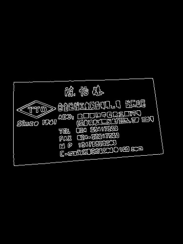
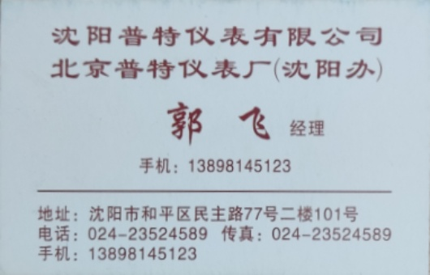

# Final

> 数据科学与计算机学院 2019 级 软件工程 教务二班 梁文杰 16303050

## 任务一

任务一分成两部分来完成，一部分为将名片从原图提取出来，并将其摆正。另一个部分则对名片内容进行初步的切割。

### 名片提取

#### 边缘检测

将原图统一重命名。导入后先对图片尺寸进行调整，随后进行高斯滤波并进行边缘检测。实现前后景分割。

```python
for i in range(1, 23):
    # 导入图片并调整尺寸
    img = cv2.imread(f'../DataSet/{i}.jpg')
    img = imutils.resize(img, height=500)

    # 边缘检测
    gray = cv2.GaussianBlur(img, (5, 5), 0)
    edged = cv2.Canny(gray, 80, 230)
    cv2.imwrite(f'../DataSet/gray_{i}.jpg', gray)
    cv2.imwrite(f'../DataSet/edged_{i}.jpg', edged)
```




#### 寻找名片轮廓

找到轮廓后将轮廓根据轮廓面积大小排序，找到第一个四边形的轮廓。并将名片的四个顶点标记出来。

```python
# 寻找名片轮廓
def find_contour(edged):
    # 寻找轮廓
    cnts = cv2.findContours(edged, cv2.RETR_EXTERNAL, cv2.CHAIN_APPROX_SIMPLE)
    cnts = cnts[0] if imutils.is_cv2() else cnts[1]

    # 根据轮廓面积排序
    cnts = sorted(cnts, key=cv2.contourArea, reverse=True)
    for c in cnts:
        peri = cv2.arcLength(c, True)                  # 计算轮廓周长
        approx = cv2.approxPolyDP(c, 0.02*peri, True)  # 轮廓多边形拟合
        if len(approx) == 4:  # 如果是四边形就返回
            return approx
    return []

# 将顶点标记并保存图片
def save_peaks(img, peaks, path):
    tmp = img.copy()
    cv2.circle(tmp, tuple(peaks[0]), 10, black, 5)
    cv2.circle(tmp, tuple(peaks[1]), 10, red, 5)
    cv2.circle(tmp, tuple(peaks[2]), 10, blue, 5)
    cv2.circle(tmp, tuple(peaks[3]), 10, white, 5)
    cv2.imwrite(path, tmp)
```


#### 图形变换

将顶点进行排序后，就可根据顶点所在位置将名片纠正过来。

```python
# 顶点排序
def sort_peaks(peaks):
    peaks = peaks[np.lexsort([peaks[:, 1]])]
    up, down = peaks[:2], peaks[2:]
    up = peaks[np.lexsort([up[:, 0]])]
    down = down[np.lexsort([down[:, 0]])]
    peaks = np.concatenate((up, down))
    return peaks


# 名片纠正
def transform():
    for i in range(1, 23):
        # ...

        # 寻找名片轮廓
        src = np.float32(find_contour(edged)).reshape(-1, 2)
        if len(src) > 0:
            print(f'picture{i}')

            # 确定平面在原图中的顶点位置
            src = sort_peaks(src)
            save_peaks(img, src, f'../DataSet/peaks_{i}.jpg')

            # 确定纠正后名片的尺寸
            width, height = src[1][0] - src[0][0], src[2][1] - src[0][1]
            dst = np.float32(
                [[0, 0], [width, 0], [0, height], [width, height]])

            # 名片纠正
            m = cv2.getPerspectiveTransform(src, dst)
            result = cv2.warpPerspective(img, m, (width, height))
            cv2.imwrite(f'../Dataset/result_{i}.jpg', result)
```





### 名片切割

#### 边缘检测

对上一步骤提取出来的名片进行下一步的切割，首先还是要对图片进行边缘检测，然后进行腐蚀和膨胀操作，尽量将同一区域的文字或数字连在一起。

```python
# 名片切割
def segmentation():
    for i in range(1, 12):
        img = cv2.imread(f'../cards/{i}.jpg')

        # 边缘检测
        edged = cv2.Canny(img, 80, 230)
        kernel = cv2.getStructuringElement(cv2.MORPH_RECT, (15, 1))
        dilation = cv2.dilate(edged, kernel)
        erosion = cv2.erode(dilation, kernel)
        cv2.imwrite(f'../cards/edged_{i}.jpg', edged)
        cv2.imwrite(f'../cards/dilation_{i}.jpg', dilation)
        cv2.imwrite(f'../cards/erosion_{i}.jpg', erosion)
```


#### 寻找文字区域

在上述腐蚀后的图片中寻找外接矩形轮廓，并在原图上标记出来。

```python
# 名片切割
def segmentation():
    for i in range(1, 12):
        # ...

        # 寻找轮廓
        cnts = cv2.findContours(
            erosion, cv2.RETR_EXTERNAL, cv2.CHAIN_APPROX_SIMPLE)
        cnts = cnts[0] if imutils.is_cv2() else cnts[1]

        # 用外接矩形标记
        result = img.copy()
        for cnt in cnts:
            x, y, w, h = cv2.boundingRect(cnt)  # 外接矩形
            cv2.rectangle(result, (x, y), (x + w, y + h), green, 1)
        cv2.imwrite(f'../cards/contour_{i}.jpg', result)
```


### 待续

任务一只对名片进行初步的切割，在任务二中将进一步筛选标记的矩形区域，确定所需信息所在的区域并将其提取出来。
