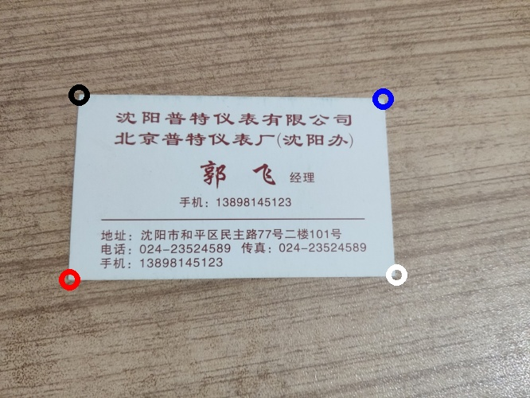
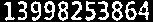
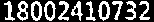

# Final

> 数据科学与计算机学院 2019 级 软件工程 教务二班 梁文杰 16303050

## 任务一

任务一分成两部分来完成，一部分为将名片从原图提取出来，并将其摆正。另一个部分则对名片内容进行初步的切割。

### 名片提取

#### 边缘检测

将原图统一重命名。导入后先对图片尺寸进行调整，随后进行高斯滤波并进行边缘检测。实现前后景分割。方便确定名片边界，对图片进行一组膨胀/腐蚀操作。

```python
for i in range(1, 23):
    # 导入图片并调整尺寸
    img = cv2.imread(f'../DataSet/{i}.jpg')
    img = imutils.resize(img, height=500)

    # 边缘检测
    gray = cv2.GaussianBlur(img, (5, 5), 0)
    edged = cv2.Canny(gray, 80, 230)
    cv2.imwrite(f'../DataSet/gray_{i}.jpg', gray)
    cv2.imwrite(f'../DataSet/edged_{i}.jpg', edged)

    # 膨胀/腐蚀
    kernel = cv2.getStructuringElement(cv2.MORPH_RECT, (1, 17))
    dilation = cv2.dilate(edged, kernel)
    erosion = cv2.erode(dilation, kernel)
    cv2.imwrite(f'../DataSet/dilation_{i}.jpg', dilation)
    cv2.imwrite(f'../DataSet/erosion_{i}.jpg', erosion)
```


#### 寻找名片轮廓

找到轮廓后将轮廓根据轮廓面积大小排序，找到第一个四边形的轮廓。并将名片的四个顶点标记出来。

```python
# 寻找名片轮廓
def find_contour(edged):
    # 寻找轮廓
    cnts = cv2.findContours(edged, cv2.RETR_EXTERNAL, cv2.CHAIN_APPROX_SIMPLE)
    cnts = cnts[0] if imutils.is_cv2() else cnts[1]

    # 根据轮廓面积排序
    cnts = sorted(cnts, key=cv2.contourArea, reverse=True)
    for c in cnts:
        peri = cv2.arcLength(c, True)                  # 计算轮廓周长
        approx = cv2.approxPolyDP(c, 0.02*peri, True)  # 轮廓多边形拟合
        if len(approx) == 4:  # 如果是四边形就返回
            return approx
    return []

# 将顶点标记并保存图片
def save_peaks(img, peaks, path):
    tmp = img.copy()
    cv2.circle(tmp, tuple(peaks[0]), 10, black, 5)
    cv2.circle(tmp, tuple(peaks[1]), 10, red, 5)
    cv2.circle(tmp, tuple(peaks[2]), 10, blue, 5)
    cv2.circle(tmp, tuple(peaks[3]), 10, white, 5)
    cv2.imwrite(path, tmp)
```





#### 图形变换

将顶点进行排序后，就可根据顶点所在位置将名片纠正过来，并统一图片尺寸为 530*340。

```python
# 顶点排序
def sort_peaks(peaks):
    peaks = peaks[np.lexsort([peaks[:, 1]])]
    up, down = peaks[:2], peaks[2:]
    up = peaks[np.lexsort([up[:, 0]])]
    down = down[np.lexsort([down[:, 0]])]
    peaks = np.concatenate((up, down))
    return peaks


# 名片纠正
def transform():
    for i in range(1, 23):
        # ...

        # 寻找名片轮廓
        src = np.float32(find_contour(edged)).reshape(-1, 2)
        if len(src) > 0:
            print(f'picture{i}')

            # 确定平面在原图中的顶点位置
            src = sort_peaks(src)
            save_peaks(img, src, f'../DataSet/peaks_{i}.jpg')

            # 确定纠正后名片的尺寸
            width, height = src[1][0] - src[0][0], src[2][1] - src[0][1]
            dst = np.float32(
                [[0, 0], [width, 0], [0, height], [width, height]])

            # 名片纠正
            m = cv2.getPerspectiveTransform(src, dst)
            result = cv2.warpPerspective(img, m, (width, height))
            result = cv2.resize(result, (530, 340), 0, 0, cv2.INTER_LINEAR)
            cv2.imwrite(f'../Dataset/result_{i}.jpg', result)
```


## 任务二

### 图像分割

分割前先进行二值化以及膨胀操作，膨胀后寻找图片的轮廓，将图片切分成多个区域，并将小的区域删除。

```python
# 名片切割
for i in range(1, 6):
    img = cv2.imread(f'../cards/{i}.jpg')
    # 二值化
    gray = cv2.cvtColor(img, cv2.COLOR_BGR2GRAY)
    bin = cv2.adaptiveThreshold(
        gray, 255, cv2.ADAPTIVE_THRESH_GAUSSIAN_C, cv2.THRESH_BINARY_INV, 9, 5)
    # 删除小连通块
    con = bin.copy()
    cnts = find_contours(bin, 5, 3)
    for cnt in cnts:
        area = cv2.contourArea(cnt)
        if area < 80:
            cv2.drawContours(con, [cnt], 0, 0, -1)
    # 保存连通块
    cnts = find_contours(con, 21, 3)
    index = 0
    for cnt in cnts:
        sub = sub_img(con, cnt)
        imsave(sub, f'contour/{i}_{index}')
        index += 1
    
            
# 寻找轮廓
def find_contours(img, w, h):
    # 膨胀
    kernel = cv2.getStructuringElement(cv2.MORPH_RECT, (w, h))
    dialtion = cv2.dilate(img, kernel)
    # 寻找轮廓
    cnts = cv2.findContours(dialtion, cv2.RETR_EXTERNAL,
                            cv2.CHAIN_APPROX_SIMPLE)
    return cnts[0] if imutils.is_cv2() else cnts[1]
```


然后可以通过垂直投影的方式将连通块分割成单个字符。但其实后来发现，没有必要将字符切割出来单独识别，整体识别的效果比单独识别要好。

```python
# 切割出单个字符
cnts = find_contours(con, 5, 3)
index = 0
for cnt in cnts:
    # 根据轮廓切割区域
    sub = sub_img(con, cnt)

    # 统计垂直投影像素个数
    pixs = np.zeros(sub.shape[1], np.uint8)
    for j in range(sub.shape[1]):
        for k in range(sub.shape[0]):
            pixs[j] += 1 if sub[k][j] == 255 else 0

    j = 0
    while j < sub.shape[1]:
        # 根据垂直投影切割字符
        while j < sub.shape[1] and pixs[j] == 0:
            j += 1
        if j >= sub.shape[1]:
            break
        left = j
        while j < sub.shape[1] and pixs[j] != 0:
            j += 1
        right = j

        if right - left > 1:
            if left > 0:
                left = left - 1
            if right < sub.shape[1]:
                right = right + 1
            sigle = sub[:, left-1:right+1]
            # 保存字符
            if sigle.shape[0] > 5 and sigle.shape[1] > 5 and sigle.shape[0] > 10 or sigle.shape[1] > 10:
                imsave(sigle, f'num/{i}_{index}')
                index += 1
```


### 电话号码识别

由于一般每个名片都会有一个 11 位的手机号码，所以在本实验中，只对 11 位的手机号码进行提取和识别。

首先经过膨胀操作后得到连通块，并筛选出横纵比大于 6 且纵横比小于 1 的连通块，然后在剩下的连通块中识别出数字，如果识别出来的字符串是 11 位的数字字符串，则认为可能是手机号码。

```python
def identify_phone(img):
    tels = []
    cnts = find_contours(img, 9, 3)
    for cnt in cnts:
        sub = sub_img(con, cnt)
        if sub.shape[1] / sub.shape[0] < 6 or sub.shape[0] / sub.shape[1] > 1:
            continue
        text = pytesseract.image_to_string(
            sub, 'chi_sim', config='-psm 6 digits')
        text = re.sub('\r|\n|\t| ', '', text)
        if len(text) > 0 and text[0] == '-':
            text = text[1:]
        if len(text) == 11:
            tels.append(text)
    return tels
```

比如，在以下连通块区域中能够识别出手机号码：







### 姓名识别

同样，首先经过膨胀操作后得到连通块，并筛选出横纵比大于 4 且纵横比小于 1 的连通块。由于姓名在整个名片中通常是最大尺寸的汉字，所以在剩下的连通块里根据连通块大小排序。然后从大到小识别连通块，如果识别出来的结果是 2 个汉字或 3 个汉字，则认为可能是姓名。

```python
def identify_name(img, tmp, tag):
    name = None
    cnts = find_contours(img, 21, 3)
    cnts = sorted(cnts, key=cv2.contourArea, reverse=True)
    draw_contours(tmp, cnts, tag)
    for cnt in cnts:
        sub = sub_img(con, cnt)
        if sub.shape[1] / sub.shape[0] > 4 or sub.shape[0] / sub.shape[1] > 1:
            continue
        text = pytesseract.image_to_string(
            sub, 'chi_sim', config='-psm 6')
        text = re.sub('\r|\n|\t|-| ', '', text)
        if not name and (len(text) == 2 or len(text) == 3) and is_Chinese(text):
            name = text
    return name

def is_Chinese(word):
    for ch in word:
        if ch < '\u4e00' or ch > '\u9fff':
            return False
    return True
```

比如，在以下连通块区域中能够识别出姓名：


### 公司识别

同样，首先经过膨胀操作后得到连通块，并筛选出横纵比大于 6 且纵横比小于 1 的连通块。如果识别出来的结果有“公司”字段，则认为该连通块的识别结果可能是公司名称。

```python
def identify_company(img):
    cnts = find_contours(img, 17, 3)
    cnts = sorted(cnts, key=cv2.contourArea, reverse=True)
    for cnt in cnts:
        sub = sub_img(con, cnt)
        if sub.shape[1] / sub.shape[0] < 6 or sub.shape[0] / sub.shape[1] > 1:
            continue
        text = pytesseract.image_to_string(
            sub, 'chi_sim', config='-psm 6')
        text = re.sub('\r|\n|\t|-| ', '', text)
        if len(text) > 0 and text.find('公司') != -1:
            return text
    return None
```

比如，在以下连通块区域中能够识别出公司名称：


## 运行结果（部分）


## 总结

公司和电话有部分名片还是能识别出来的，但姓名看起来就只有几个是正确的，准确率并不高，因此在连通块区域的识别还需要加强，即加强对区域的识别，而不是通过对识别字段进行判断。但各类名片排版千奇百怪，仅仅通过腐蚀膨胀投影的操作区分开连通块还是不太足够，尽管如此，只要原图片分辨率够高，对电话号码的识别还是足够的了。